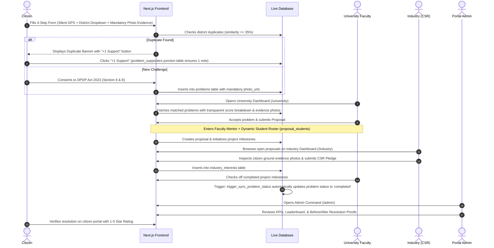

# Jan Samadhan (जन समाधान) — Team Master Guide
## Architecture, Data Models, Workflows, and Technical Q&A Reference

> **For All Team Members**: This internal guide explains the Jan Samadhan platform end-to-end so anyone on our team can confidently answer technical, architectural, and UX questions during presentations.

---

## 🧭 1. What Are We Building & Why?
- **Problem**: Citizens encounter ground challenges (broken pipelines, contaminated groundwater, infrastructure failures). Traditional municipal processes lack direct technical execution capacity and funding agility.
- **Our Solution**: A collaborative governance platform connecting **Citizens**, **Universities**, **Industries**, and **Administrators** with real-time data, transparent algorithmic matching, dynamic student team assignments, CSR funding grants, and verifiable ground resolution proofs.

---

## 🧱 2. Technology Stack & Directory Layout

```
jharkhand-governance-portal/
├── supabase/                 # Database Migrations (Run in order: 001 -> 004)
│   ├── 001_schema.sql        # Tables, foreign keys, mandatory photo evidence, 3 triggers
│   ├── 002_rls_policies.sql  # Row Level Security (RLS) + Storage bucket policies
│   ├── 003_seed_data.sql     # Seed data: access codes, problems, milestones, proofs
│   └── 004_functions.sql     # Atomic RPCs: redeem_access_code, toggle_problem_support, admin_override
├── scripts/
│   └── seed.ts               # TypeScript Auth seed script using Supabase Service Key
├── src/
│   ├── middleware.ts         # Session token refresh & route protection with safe matcher
│   ├── lib/
│   │   ├── constants.ts      # Districts, 11 Domains, DPDP Act 2023 legal consent
│   │   ├── matching.ts       # Deterministic scoring: Domain(50) + Dist(30) + Keywords(20)
│   │   ├── duplicate-detector.ts # Title token overlap (Jaccard similarity threshold 35%)
│   │   └── supabase/
│   │       ├── client.ts     # Browser client via @supabase/ssr
│   │       └── server.ts     # Server client via @supabase/ssr (cookies)
│   ├── components/
│   │   ├── common/           # Header, SkipLink, Toast, QuickLoginDrawer
│   │   ├── citizen/          # ProblemSubmissionWizard, DuplicateBanner, TrackReports, CitizenRatingModal
│   │   ├── university/       # MatchQueue, TeamBuilder, ProposalModal, MilestoneTracker, LessonsLearned
│   │   ├── industry/         # ProposalBrowser, ExpressInterestModal, MyCommitments
│   │   └── admin/            # StateKpis, AnalyticsCharts, LeaderboardTable, OverrideCenter, AccessCodeManager, ResolutionProofModal
│   └── app/
│       ├── layout.tsx        # GIGW layout wrapper with SkipLink and Header
│       ├── page.tsx          # Homepage directory with quick login drawer
│       ├── login/page.tsx    # Auth screen: email/mobile, mock OTP, tabs
│       ├── citizen/page.tsx  # Citizen challenge reporting & tracking
│       ├── university/page.tsx # University matched queue & student team builder
│       ├── industry/page.tsx # Industry CSR proposal discovery & pledges
│       └── admin/page.tsx    # Command center & resolution proofs
├── SETUP_GUIDE.md            # Step-by-step setup instructions for running the app
├── CREDENTIALS.md            # Table of all 12 pre-seeded demo accounts
├── TEAM_GUIDE.md             # This internal guide
└── README.md                 # Public project overview and documentation
```

---

## 🔄 3. Complete End-to-End Workflow



---

## 🗄️ 4. The 9 Database Tables & Relationships

1. **`profiles`**: Linked 1-to-1 with `auth.users(id)`. Stores user metadata (`role`, `org_name`, `district`, `domain_tags`, `facilities`, `expertise`).
2. **`access_codes`**: Manages single-use 8-character codes (`PREFIX-JH-####`). Prevents unauthorized institutional signups.
3. **`problems`**: All societal challenges reported by citizens. Stores status (`pending`, `assigned`, `in_progress`, `testing`, `completed`), district, masked coordinates, support count, and mandatory `photo_urls` array.
4. **`problem_supporters`**: Junction table `(problem_id, user_id)` with a `UNIQUE` constraint. Ensures a citizen can only upvote an issue once.
5. **`proposals`**: University solution proposals. Links problem to institution, stores mentor details, budget, timeline, and `cancellation_reason` (used for the Lessons Learned archive).
6. **`proposal_students`**: Normalized student team roster (`student_name`, `student_roll_no`).
7. **`industry_interests`**: Corporate CSR pledges (`funding`, `mentorship`, `both`), grant amounts, and messages.
8. **`milestones`**: Project execution stages. Checked off by universities.
9. **`impact_metrics`**: Ground resolution proofs: Before photo, After photo, citizens benefited, costs avoided, and 1-5 star citizen satisfaction rating.

---

## ⚡ 5. The 3 PostgreSQL Triggers

### Trigger 1: `trigger_sync_support_count`
- **Location**: `supabase/001_schema.sql`
- **Action**: Runs `AFTER INSERT OR DELETE` on `problem_supporters`.
- **Purpose**: Automatically recalculates `problems.support_count = COUNT(*) FROM problem_supporters`. The frontend never has to manually update counters!

### Trigger 2: `trigger_sync_problem_status`
- **Location**: `supabase/001_schema.sql`
- **Action**: Runs `AFTER INSERT OR UPDATE OF status OR DELETE` on `milestones`.
- **Purpose**: Automatically updates `problems.status`:
  - If all milestones are completed $
ightarrow$ sets `problems.status = 'completed'`.
  - If at least one milestone is completed $
ightarrow$ sets `problems.status = 'in_progress'`.

### Trigger 3: `on_auth_user_created`
- **Location**: `supabase/001_schema.sql`
- **Action**: Runs `AFTER INSERT` on `auth.users`.
- **Purpose**: Consumes `raw_user_meta_data` and automatically creates the row in `public.profiles`. Also blocks any public self-registration with `role = 'admin'`.

---

## 🎯 6. How the Deterministic Matching Algorithm Works
When judges ask: *"Are you using AI/LLM for matching?"*  
**Our Answer**: *"No, we purposely designed a 100% explainable, deterministic scoring algorithm. In public governance, assigning government grants and municipal problems to universities cannot rely on stochastic LLM hallucinations. It must be auditable, transparent, and legally defensible."*

### The Formula:
$$	ext{Total Score} = 	ext{Domain Overlap (50)} + 	ext{District Bonus (30)} + 	ext{Keyword Overlap (20)}$$
1. **Domain Overlap (50 pts)**: Does the problem domain match the university's registered domain tags?
2. **District Proximity (30 pts)**: Is the university in the same district as the problem? (Local presence is vital for rapid on-site testing).
3. **Keyword Overlap (up to 20 pts)**: Overlap between problem text (e.g. *arsenic, filtration*) and university facilities/expertise.
4. **Admin Override**: Top matches are suggested automatically, but the Administrator can override with a single click.

---

## 🛡️ 7. DPDP Act 2023 & Accessibility Highlights

- **DPDP Act 2023 Compliance**:
  - Citizens provide explicit statutory consent under **Section 6** before submitting.
  - In compliance with **Section 8 (Data Minimisation)**, exact GPS coordinates are masked from public/industry view to protect citizen privacy, accessible only to authorized district officers.
- **GIGW & WCAG 2.0 AA Design System**:
  - Colors strictly limited to: Dark Forest Green `#1B5E20`, Urgent `#B3261E` + ⚠️, Orange `#E65100`, Neutral `#F8F9FA` / `#1C1B1F`.
  - 3px orange focus ring on every interactive element.
  - All touch targets $\ge 44 	imes 44	ext{px}$.
  - Visually-hidden "Skip to Main Content" link.
  - Simulated **English | हिन्दी** language toggle with toast notification.

---

## 🎤 8. Demo Script & Walkthrough

1. **Start on Homepage (`/`)**:
   - Show the **1-Click Demo Evaluation Drawer**: demonstrate that all 12 accounts across 4 roles are accessible in 1 click.
2. **Citizen Submission (`/citizen`)**:
   - Log in as **Ramesh Kumar (Citizen)**.
   - Walk through the 4-step wizard.
   - Show that **Photographic Evidence is strictly mandatory** (cannot advance Step 3 without uploading).
   - Highlight **Silent Geolocation + District Dropdown**.
   - Show the **Duplicate Detection Banner** and upvote an issue (+1 Support).
   - Point to the **DPDP Act 2023 legal consent checkbox**.
3. **University Problem Acceptance (`/university`)**:
   - Switch to **BIT Mesra** or **IIT (ISM) Dhanbad**.
   - Show the **Matched Queue**: point out the transparent match score (e.g. 85/100), explainable reasoning breakdown, and citizen evidence photos.
   - Open the proposal modal: review citizen photos, show **Faculty Mentor details** + **Dynamic Student Team Roster**.
   - Check off a milestone: show that the problem status changes automatically via the Postgres trigger.
   - Click **Lessons Learned Archive**: show how declined challenges preserve technical constraints.
4. **Industry CSR Sponsorship (`/industry`)**:
   - Switch to **Tata Steel Limited**.
   - Filter proposals by domain and district.
   - Inspect citizen evidence photos directly on the proposal card.
   - Click **Express CSR Interest**: pledge funding grant capital or mentorship.
5. **Admin Command Center (`/admin`)**:
   - Switch to **Jan Samadhan Administrator**.
   - Show the **KPIs**, visual domain distribution, and tabular **Performance Ledger**.
   - Demonstrate the **Assignment Override Center** (reassign an allocation).
   - Generate a new single-use access code (`UNIV-JH-####`).
   - Open **Resolution Proofs**: showcase side-by-side Before/After photos and 5-star citizen verification ratings!
